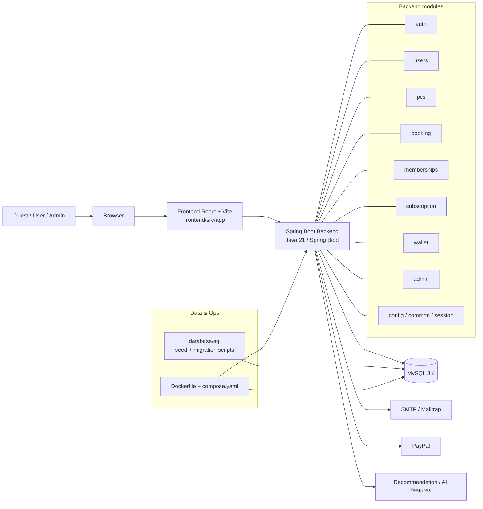

**Onnet-PC — Project Structure & Flows**

**Overview:**
- **Project type:** Full-stack monorepo (Spring Boot backend + React/Vite frontend).
- **Purpose:** PC rental platform — browse machines, book/rent, payments, wallet, membership, admin dashboard, AI recommendations.

**Tech stack:**
- **Backend:** Java 21, Spring Boot 4 (pom.xml). 
- **Frontend:** React 19 + TypeScript, Vite (frontend/package.json).
- **Database:** MySQL (database/sql contains migrations and seed data).
- **Dev / Deploy:** Dockerfile + compose.yaml for local containerized run.

**Top-level layout:**
- **`pom.xml`**: Maven project file and dependencies.
- **`Dockerfile`**, **`compose.yaml`**: build & local compose config.
- **`frontend/`**: React/Vite app.
- **`src/main/java/com/onnet/onnetpc/`**: Spring Boot backend source, split by domain packages.
- **`database/sql/`**: migration and seed SQL scripts.
- **`docs/requirements/UC_en_v2.txt`**: functional use-cases and actors.

**Backend (major packages)**
- `auth` — authentication, JWT, email verification.
- `users` — user profile, registration, roles.
- `pcs` — computer/catalog management (specs, availability).
- `booking` — booking lifecycle, session/lock handling.
- `wallet` — user wallet top-up & payments.
- `subscription` / `memberships` — membership plans and subscriptions.
- `recommendation` — AI / suggestion features.
- `admin` — admin endpoints and dashboards.
- `config`, `common`, `session` — shared config and utilities.

Paths to inspect:
- Backend root: [src/main/java/com/onnet/onnetpc](src/main/java/com/onnet/onnetpc)
- Frontend app: [frontend/src/app](frontend/src/app)
- DB scripts: [database/sql](database/sql)
- Routes: [frontend/src/app/routes.tsx](frontend/src/app/routes.tsx)

**Frontend structure (high level)**
- `frontend/src/app/api/` — HTTP wrappers and types used to call backend APIs.
- `frontend/src/app/auth/` — `ProtectedRoute`, `AdminRoute`, `AuthProvider`.
- `frontend/src/app/pages/` — page components (Home, Computers, Checkout, Account, Dashboard, AI chat, etc.).
- `frontend/src/app/components/` — smaller UI pieces used across pages.

**Deployment / Data**
- Docker image builds via `Dockerfile` (multi-stage Java build).
- `compose.yaml` defines `mysql` and `app` services for local testing.
- Migrations and seed files are in `database/sql/` (use these when updating schema).

**Key integrations**
- **PayPal** — payment capture flows (see backend PayPal-related services in `payment`/`wallet` modules).
- **SMTP / Mailtrap** — email verification and notifications (configured in properties).
- **AI / Recommendation** — separate module for suggesting configurations.

**Luồng nghiệp vụ (Guest → User → Admin)**
- **Guest:** xem danh sách máy (Frontend: `/`, `/computers`), xem chi tiết (`/computers/:id`), đăng ký/đăng nhập (`/login`, `/verify-email`). Backend xử lý: `pcs`, `users`, `auth`.
- **User (đã đăng nhập):** chọn máy → vào `checkout` → thanh toán (PayPal hoặc wallet). Sau thanh toán, `booking` tạo session/booking record; `wallet` cập nhật nếu dùng ví; `subscription`/`memberships` áp dụng ưu đãi. Các màn hình: `/checkout`, `/wallet`, `/account/*`.
- **Admin:** quản lý máy, đơn hàng, tài khoản, hóa đơn, phiên (sessions) và dashboard tổng quan. Frontend routes được bảo vệ bằng `AdminRoute`; backend có module `admin` + `pcs` + `booking` + `users` endpoints.

**How to run (local quick notes)**
1. Start DB + app with Docker Compose:

```bash
docker compose up --build
```

2. Frontend dev server (inside `frontend/`):

```bash
cd frontend
npm install
npm run dev
```

**Notes / Next steps**
- File list and module mapping are based on current repo layout; if muốn bản chi tiết API (endpoint → controller → service → repo), tôi có thể sinh thêm bảng ánh xạ.

---
Generated: brief project structure and main flows for developer onboarding.

**Onnet-PC architecture (diagram)**



**Endpoint → Controller → Service → Repository (high-level mapping)**

- `AuthController` (`/api/v1/auth`)
	- endpoints: `POST /register`, `POST /login`, `POST /verify-email`, `POST /forgot-password`, `POST /reset-password`
	- service: `AuthService`
	- repos: `UserRepository`, `EmailVerificationTokenRepository`, `PasswordResetTokenRepository` (see `auth/repository`)

- `UserController` (`/api/v1/users/me`)
	- endpoints: `GET /`, `PATCH /`, `POST /change-password`
	- service: `UserService`
	- repos: `UserRepository` (see `users/repository`)

- `PcController` (`/api/v1/pcs`)
	- endpoints: `GET /` (list), `GET /{pcId}` (detail), `GET /specs/{specId}/plans`
	- service: `PcService`
	- repos: `PcRepository`, `PcSpecRepository`, `ReviewRepository` (see `pcs/repository`)

- `BookingController` (`/api/v1/bookings`)
	- endpoints: `POST /hourly`, `POST /subscription`, `POST /rent`, `POST /{bookingId}/pay-wallet`, `POST /{bookingId}/cancel`, `POST /{bookingId}/start-session`, `GET /my`, `POST /{bookingId}/reviews`
	- service: `BookingService`, `SessionLifecycleService`
	- repos: `BookingRepository`, `BookingLock / SessionRepository` (see `booking/repository`)

- `WalletController` (`/api/v1/wallet`)
	- endpoints: `GET /`, `GET /transactions`, `POST /top-up`
	- service: `WalletService`
	- repos: `WalletRepository`, `WalletTransactionRepository`, PayPal integrations under `wallet/paypal`

- `AdminController` (`/api/v1/admin`)
	- endpoints: management endpoints for users, payments/topups, sessions, packages, pcs, bookings, reviews
	- service: `AdminService`
	- repos: many admin-facing repositories (users, bookings, payments, pcs)

Notes:
- Mappings above are high-level and reflect file structure under `src/main/java/com/onnet/onnetpc/*`.
- For a full endpoint table (every route → exact controller method → service method → repository), I can auto-generate a CSV by scanning controller classes and mapping injected services and repository usages.

---
Updated: added architecture diagram and high-level endpoint mappings.
